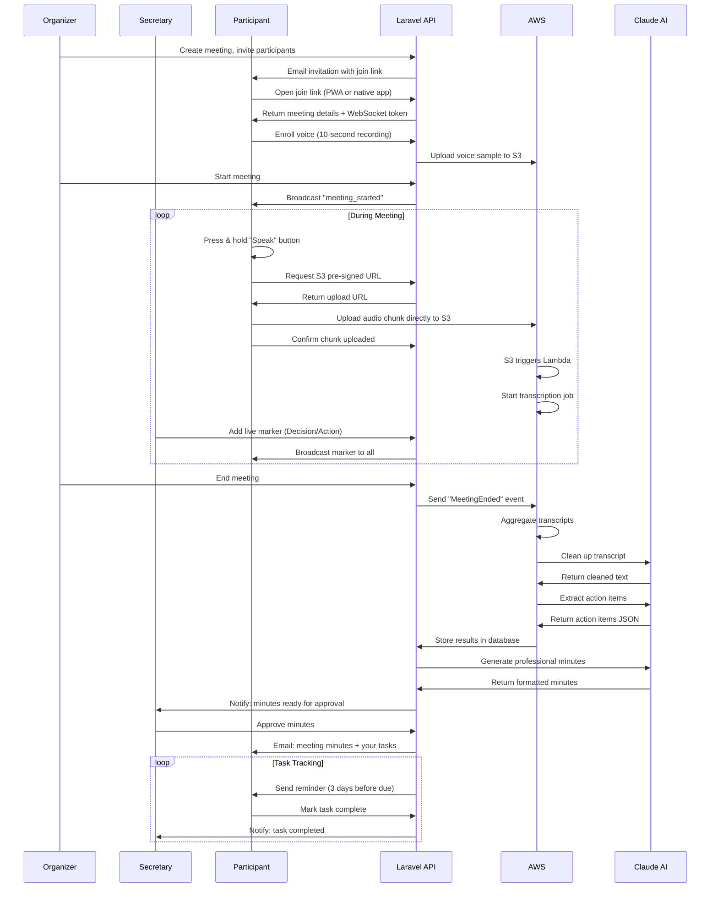

# Meeting Minutes & Action Tracker SaaS
## Part 1: Executive Summary & System Architecture

**Version:** 2.0  
**Last Updated:** February 2025  
**Technology Stack:** Laravel 12, React PWA, NativePHP Mobile, AWS Serverless  
**Target Launch:** 6-8 weeks from start  

---

## 1. Executive Summary

### The Problem
Organizations hold frequent, long **in-person** meetings where secretaries must:
- Record audio and transcribe it manually (2-4 hours per 1-hour meeting)
- Clean up transcripts and identify speakers
- Extract decisions and action items
- Email each participant their tasks individually
- Send reminders and track task completion
- Generate professional meeting minutes

**Current solutions** (Microsoft Teams, Zoom) only work for online meetings or require expensive room microphone installations ($2,000-10,000).

### The Solution
A **low-hardware, low-cost** SaaS platform that:
- Uses participants' **phones as microphones** (PWA + native mobile apps)
- Provides **accurate speaker attribution** through authenticated sessions
- Offers **minimal battery drain** through smart recording strategies
- Automates **transcript cleanup, action extraction, and minutes generation**
- Includes **built-in task tracking with automated reminders**
- Deploys on **event-driven AWS** infrastructure (pay only when used)

### Key Innovation: Speaker ID as a Data Problem, Not AI Guessing

**Primary Method: Session-Based Attribution**
- Each participant's phone = their authenticated microphone
- Speaker attribution = user session identity (100% accurate)
- No expensive AI diarization needed for primary workflow
- Dramatically reduces costs and complexity

**Fallback Method: Room Capture + Diarization**
- Secretary's device can record room audio for missed moments
- AWS Transcribe Speaker Diarization splits speakers
- Segments marked "Unattributed" until manual assignment
- Secretary assigns segments or participants claim them

### Business Model & Market Position

**Pricing Tiers:**
- **Starter:** $49/month - 5 meetings, text-only
- **Professional:** $199/month - 25 meetings, 30-day audio retention
- **Business:** $499/month - 100 meetings, advanced features
- **Enterprise:** $2,000+/month - Custom, white-label, compliance

**Target Markets:**
1. Corporate teams (weekly standups, board meetings)
2. Healthcare (clinical meetings, case reviews)
3. Legal firms (client meetings, depositions)
4. Educational institutions (faculty meetings, committee meetings)
5. Government agencies (commission meetings, hearings)

**Competitive Advantage:**
- 10x cheaper than traditional transcription services ($1-3/minute)
- No hardware required (vs. $2,000-10,000 for meeting room systems)
- Accurate speaker identification (vs. 70-80% accuracy in AI diarization)
- Built-in task management (competitors require separate tools)

---

## 2. Core Architecture

### 2.1 Technology Stack

```yaml
Frontend:
  PWA: React 18 + TypeScript + Vite
  Mobile: NativePHP Mobile v3 (iOS + Android)
  UI: TailwindCSS
  State: React Query + Context API
  Realtime: Laravel Reverb (WebSocket)

Backend:
  Framework: Laravel 12
  Database: PostgreSQL 16
  Cache: Redis 7
  Queue: Laravel Horizon
  Multitenancy: Your existing starter kit
  Auth: Laravel Sanctum
  Permissions: Spatie Laravel Permission

AWS Serverless:
  Storage: S3 (audio, transcripts, minutes)
  Compute: Lambda (Python 3.11)
  Transcription: AWS Transcribe
  AI: AWS Bedrock (Claude Haiku/Sonnet)
  Queue: SQS
  Events: EventBridge
  Email: SES
  Monitoring: CloudWatch

DevOps:
  IaC: Terraform
  CI/CD: GitHub Actions
  Deployment: Laravel Forge (backend) + AWS (serverless)
  Monitoring: CloudWatch + Laravel Telescope
```

### 2.2 High-Level System Architecture

```
┌─────────────────────────────────────────────────────────────────┐
│                    CLIENT LAYER                                  │
│                                                                   │
│  ┌────────────────┐  ┌─────────────────┐  ┌─────────────────┐  │
│  │  React PWA     │  │ NativePHP iOS   │  │ NativePHP Andr. │  │
│  │  • Web access  │  │  • Background   │  │  • Background   │  │
│  │  • Push-to-talk│  │    recording    │  │    recording    │  │
│  │  • Offline     │  │  • Push notifs  │  │  • Push notifs  │  │
│  │  • IndexedDB   │  │  • Native APIs  │  │  • Native APIs  │  │
│  └────────────────┘  └─────────────────┘  └─────────────────┘  │
└─────────────────────────────────────────────────────────────────┘
                         ↓ HTTPS/WebSocket
┌─────────────────────────────────────────────────────────────────┐
│              API LAYER (Laravel 12 + Your Starter Kit)          │
│                                                                   │
│  ┌──────────────────────────────────────────────────────────────┐│
│  │  Existing Infrastructure (From Your Starter Kit)            ││
│  │  ✓ Multi-tenant architecture                                ││
│  │  ✓ User authentication & authorization                      ││
│  │  ✓ Payment processing & subscriptions                       ││
│  │  ✓ Tenant management & settings                             ││
│  │  ✓ Admin dashboard                                          ││
│  └──────────────────────────────────────────────────────────────┘│
│                                                                   │
│  ┌──────────────────────────────────────────────────────────────┐│
│  │  New Meeting-Specific Features                              ││
│  │  • Meeting CRUD & participant management                    ││
│  │  • Audio chunk upload coordination                          ││
│  │  • Transcript storage & retrieval                           ││
│  │  • Action item tracking                                     ││
│  │  • Meeting minutes approval workflow                        ││
│  └──────────────────────────────────────────────────────────────┘│
│                                                                   │
│  ┌──────────────────────────────────────────────────────────────┐│
│  │  WebSocket Server (Laravel Reverb)                          ││
│  │  • Real-time participant presence                           ││
│  │  • Live speaking indicators                                 ││
│  │  • Secretary markers broadcast                              ││
│  │  • Floor control coordination                               ││
│  └──────────────────────────────────────────────────────────────┘│
│                                                                   │
│  ┌──────────────────────────────────────────────────────────────┐│
│  │  Queue Workers (Laravel Horizon)                            ││
│  │  • Process completed meetings                               ││
│  │  • Trigger AI cleanup & extraction                          ││
│  │  • Send task notifications                                  ││
│  │  • Generate and distribute minutes                          ││
│  └──────────────────────────────────────────────────────────────┘│
└─────────────────────────────────────────────────────────────────┘
                         ↓
┌─────────────────────────────────────────────────────────────────┐
│                 AWS SERVERLESS LAYER                             │
│                                                                   │
│  ┌──────────┐  ┌───────────┐  ┌─────────────┐  ┌─────────────┐ │
│  │    S3    │  │  Lambda   │  │  Transcribe │  │   Bedrock   │ │
│  │  Audio   │  │  Process  │  │   Speech    │  │   Claude    │ │
│  │  Chunks  │  │  & Queue  │  │   to Text   │  │   AI NLP    │ │
│  └──────────┘  └───────────┘  └─────────────┘  └─────────────┘ │
│                                                                   │
│  ┌──────────┐  ┌───────────┐  ┌─────────────┐  ┌─────────────┐ │
│  │   SQS    │  │EventBridge│  │     SES     │  │ CloudWatch  │ │
│  │  Queues  │  │ Scheduled │  │   Emails    │  │   Metrics   │ │
│  └──────────┘  └───────────┘  └─────────────┘  └─────────────┘ │
└─────────────────────────────────────────────────────────────────┘
                         ↓
┌─────────────────────────────────────────────────────────────────┐
│              DATABASE LAYER (PostgreSQL 16)                      │
│                                                                   │
│  Existing Tables:                 New Tables:                    │
│  • tenants                        • meetings                     │
│  • users                          • meeting_participants         │
│  • subscriptions                  • audio_segments               │
│  • permissions                    • transcript_segments          │
│  • roles                          • action_items                 │
│                                   • meeting_minutes              │
│                                   • secretary_markers            │
│                                   • task_reminders               │
│                                   • notifications                │
└─────────────────────────────────────────────────────────────────┘
```

### 2.3 NativePHP Mobile Integration

**Why NativePHP Mobile v3:**
- Build native iOS/Android apps from Laravel codebase
- Share business logic with web application
- Access native device APIs (background recording, notifications)
- Faster development than separate React Native/Flutter apps
- Single codebase for web + mobile

**Key Features Enabled:**

1. **Background Audio Recording**
```php
// NativePHP API for background tasks
use Native\Laravel\Facades\Audio;
use Native\Laravel\Facades\Background;

Background::register('audio-recorder', function () {
    // Keep audio recording alive even when app backgrounded
    Audio::record([
        'format' => 'webm',
        'quality' => 'high',
        'background' => true
    ]);
});
```

2. **Local Push Notifications**
```php
use Native\Laravel\Facades\Notification;

// Notify user when it's their turn to speak (floor control)
Notification::show('Your Turn to Speak')
    ->body('The floor has been granted to you')
    ->sound('default')
    ->send();
```

3. **Offline Audio Buffering**
```php
use Native\Laravel\Facades\Storage;

// Store audio chunks locally when offline
Storage::local()->put("offline-chunks/{$meetingId}/{$timestamp}.webm", $audioBlob);

// Sync when online
if (Network::isOnline()) {
    $chunks = Storage::local()->files("offline-chunks/{$meetingId}");
    foreach ($chunks as $chunk) {
        $this->uploadToS3($chunk);
        Storage::local()->delete($chunk);
    }
}
```

4. **Native Biometric Authentication**
```php
use Native\Laravel\Facades\Biometrics;

// Secure meeting access with Face ID / Touch ID
if (Biometrics::authenticate('Access secure meeting')) {
    $this->joinMeeting($meetingId);
}
```

**Deployment Strategy:**
- **Development:** Test on NativePHP desktop app first
- **Alpha:** Deploy to TestFlight (iOS) and Google Play Internal Testing
- **Beta:** Limited release to early adopters
- **Production:** Full App Store + Google Play release

---

## 3. Core Workflow & User Experience

### 3.1 Complete Meeting Lifecycle



### 3.2 Recording Strategy Decision Matrix

Based on the second document's recommendation, here's the critical early decision:

| Mode | Battery | Cost/Meeting | Accuracy | Use Case |
|------|---------|--------------|----------|----------|
| **Push-to-Talk (Recommended MVP)** | Minimal | $4.95 | Highest (100%) | Structured meetings, cost-conscious |
| **Floor Control** | Low | $6.50 | High (95%) | Formal meetings, one speaker at a time |
| **Open Mics** | High | $15.00 | Medium (85%) | Casual meetings, willing to pay more |
| **Auto VAD + Prompts** | Medium | $8.00 | Medium (90%) | Hybrid approach for flexibility |

**MVP Recommendation:** Start with **Push-to-Talk** as default, add **Floor Control** as optional toggle in Phase 2.

### 3.3 Speaker Identification Strategy

**Primary: Session-Based Attribution (Cheapest & Most Accurate)**
```javascript
// When participant presses "speak" button
const audioMetadata = {
  participantId: currentUser.id,        // From authenticated session
  participantName: currentUser.name,
  deviceId: deviceFingerprint,
  timestamp: Date.now(),
  method: 'push_to_talk',
  confidence: 1.0                        // 100% confident - user pressed button
};

// No AI diarization needed!
// Speaker = whoever pressed the button
```

**Fallback: Room Capture with Diarization (When Needed)**
```javascript
// Secretary's device records room audio
const roomAudio = {
  source: 'room_capture',
  requiresDiarization: true,
  segments: []  // Will be populated by AWS Transcribe
};

// After diarization
const unattributedSegments = [
  { speakerLabel: 'spk_0', text: '...' },  // Unknown speaker
  { speakerLabel: 'spk_1', text: '...' }   // Unknown speaker
];

// Secretary assigns manually
secretary.assignSegment(segment, participant);
```

---

## 4. Client Applications

### 4.1 React PWA (Primary Interface)

**Purpose:** Instant access without app install, works on all devices

**Core Features:**
- Progressive Web App installable from browser
- Offline-first architecture with service workers
- IndexedDB for local audio chunk buffering
- Background Sync API for resilient uploads
- Push notifications for task reminders

**Technical Implementation:**
```typescript
// vite.config.ts
import { defineConfig } from 'vite';
import react from '@vitejs/plugin-react';
import { VitePWA } from 'vite-plugin-pwa';

export default defineConfig({
  plugins: [
    react(),
    VitePWA({
      registerType: 'autoUpdate',
      manifest: {
        name: 'Meeting Minutes Tracker',
        short_name: 'Meetings',
        description: 'In-person meeting transcription and task tracking',
        theme_color: '#3b82f6',
        icons: [
          { src: '/icon-192.png', sizes: '192x192', type: 'image/png' },
          { src: '/icon-512.png', sizes: '512x512', type: 'image/png' }
        ],
        categories: ['productivity', 'business'],
        display: 'standalone',
        orientation: 'portrait'
      },
      workbox: {
        runtimeCaching: [
          {
            urlPattern: /^https:\/\/api\.meetingminutes\.com\/api\/.*/,
            handler: 'NetworkFirst',
            options: {
              cacheName: 'api-cache',
              expiration: {
                maxEntries: 50,
                maxAgeSeconds: 300 // 5 minutes
              }
            }
          }
        ]
      }
    })
  ]
});
```

**Key Components:**
- `MeetingLobby.tsx` - Join meeting, voice enrollment
- `MeetingRoom.tsx` - Main interface during meeting
- `PushToTalkRecorder.tsx` - Audio recording controls
- `ParticipantList.tsx` - Live participant presence
- `FloorControl.tsx` - Speaking queue management
- `SecretaryControls.tsx` - Live markers, meeting controls
- `TaskDashboard.tsx` - View assigned tasks
- `MinutesViewer.tsx` - Review and approve minutes

### 4.2 NativePHP Mobile Apps

**Purpose:** Enhanced features requiring native APIs, better performance

**Advantages over PWA:**
- True background recording (no interruption when app minimized)
- Lower battery consumption (native audio APIs)
- Local push notifications (even when app closed)
- Better offline support (native file system)
- Access to biometric authentication
- App Store presence (credibility + discovery)

**Architecture:**
```
meeting-minutes-mobile/
├── app/                          # Laravel 12 application
│   ├── Http/
│   │   ├── Controllers/
│   │   │   └── Mobile/          # Mobile-specific controllers
│   │   │       ├── MeetingController.php
│   │   │       └── AudioController.php
│   ├── NativePHP/               # NativePHP configuration
│   │   ├── Menus/
│   │   ├── Windows/
│   │   └── Events/
│   └── Services/
│       ├── AudioRecorder.php    # Background recording service
│       ├── OfflineSync.php      # Sync when back online
│       └── NotificationManager.php
├── resources/
│   └── views/
│       └── mobile/              # Mobile UI views
│           ├── meeting-room.blade.php
│           ├── participant-list.blade.php
│           └── recording-controls.blade.php
├── native/                      # NativePHP build configs
│   ├── ios/
│   │   └── Info.plist
│   └── android/
│       └── AndroidManifest.xml
└── composer.json
```

**Critical Mobile Features:**

1. **Background Audio Recording**
```php
// app/Services/AudioRecorder.php

namespace App\Services;

use Native\Laravel\Facades\Audio;
use Native\Laravel\Facades\Background;
use Native\Laravel\Facades\FileSystem;

class AudioRecorder
{
    public function startRecording(string $meetingId, string $participantId)
    {
        // Register background task
        Background::register('audio-recording', function () use ($meetingId, $participantId) {
            Audio::startRecording([
                'format' => 'webm',
                'codec' => 'opus',
                'sampleRate' => 16000,
                'channels' => 1,
                'quality' => 'high',
                'saveToTemp' => true,
                'chunkDuration' => 10 // 10-second chunks
            ]);
        });
        
        // Listen for chunk completion
        Audio::onChunkComplete(function ($chunkPath) use ($meetingId, $participantId) {
            $this->processChunk($chunkPath, $meetingId, $participantId);
        });
    }
    
    private function processChunk(string $chunkPath, string $meetingId, string $participantId)
    {
        // If online, upload immediately
        if (Network::isOnline()) {
            $this->uploadToS3($chunkPath, $meetingId, $participantId);
        } else {
            // Store locally for later sync
            $offlineDir = storage_path("offline-chunks/{$meetingId}");
            FileSystem::move($chunkPath, "{$offlineDir}/" . basename($chunkPath));
        }
    }
}
```

2. **Offline Synchronization**
```php
// app/Services/OfflineSync.php

namespace App\Services;

use Native\Laravel\Facades\Network;
use Native\Laravel\Facades\FileSystem;

class OfflineSync
{
    public function syncWhenOnline()
    {
        Network::onConnected(function () {
            $this->uploadPendingChunks();
        });
    }
    
    private function uploadPendingChunks()
    {
        $offlineDir = storage_path('offline-chunks');
        
        if (!FileSystem::exists($offlineDir)) {
            return;
        }
        
        $meetings = FileSystem::directories($offlineDir);
        
        foreach ($meetings as $meetingDir) {
            $meetingId = basename($meetingDir);
            $chunks = FileSystem::files($meetingDir);
            
            foreach ($chunks as $chunkPath) {
                try {
                    $this->uploadToS3($chunkPath, $meetingId);
                    FileSystem::delete($chunkPath);
                } catch (\Exception $e) {
                    // Keep chunk for next sync attempt
                    Log::error("Failed to upload chunk: {$chunkPath}", ['error' => $e->getMessage()]);
                }
            }
        }
    }
}
```

3. **Push Notifications**
```php
// app/Services/NotificationManager.php

namespace App\Services;

use Native\Laravel\Facades\Notification;

class NotificationManager
{
    public function notifyFloorGranted(string $participantName)
    {
        Notification::show('Your Turn to Speak')
            ->body("The floor has been granted to you, {$participantName}")
            ->sound('default')
            ->actions([
                ['label' => 'Start Speaking', 'action' => 'start_speaking'],
                ['label' => 'Decline', 'action' => 'decline_floor']
            ])
            ->send();
    }
    
    public function notifyTaskDue(string $taskTitle, string $dueDate)
    {
        Notification::show('Task Due Soon')
            ->body("{$taskTitle} is due on {$dueDate}")
            ->sound('default')
            ->badge(1)
            ->send();
    }
}
```

**Deployment Process:**
```bash
# Build iOS app
php artisan native:build ios

# Build Android app
php artisan native:build android

# Submit to App Store (requires Apple Developer account)
php artisan native:publish ios --submit

# Submit to Google Play (requires Play Console account)
php artisan native:publish android --submit
```

---

## 5. Integration with Your Existing Starter Kit

Since you already have a Laravel 12 multi-tenant starter kit with payments, we'll build on top of it:

### 5.1 Leveraging Existing Infrastructure

**What We Use from Your Starter Kit:**
- ✅ Multi-tenancy architecture (tenant isolation)
- ✅ User authentication & authorization
- ✅ Payment processing (Stripe/Paddle)
- ✅ Subscription management
- ✅ Admin dashboard
- ✅ Email notification system
- ✅ Role-based permissions (Spatie)
- ✅ API authentication (Sanctum)

**What We Add:**
- Meeting management system
- Audio upload coordination
- Transcript storage
- Action item tracking
- Meeting minutes generation
- Task reminder system

### 5.2 Subscription Plan Configuration

**Extend Your Existing Plans Table:**
```php
// database/migrations/add_meeting_features_to_plans.php

Schema::table('plans', function (Blueprint $table) {
    $table->integer('meetings_per_month')->default(0);
    $table->integer('max_participants_per_meeting')->default(10);
    $table->integer('max_meeting_duration_hours')->default(2);
    $table->boolean('audio_retention')->default(false);
    $table->integer('audio_retention_days')->nullable();
    $table->boolean('live_captions')->default(false);
    $table->boolean('room_capture')->default(false);
    $table->boolean('custom_vocabulary')->default(false);
    $table->boolean('api_access')->default(false);
});
```

**Feature Gate Implementation:**
```php
// app/Services/FeatureGate.php

namespace App\Services;

class FeatureGate
{
    public static function canCreateMeeting(): bool
    {
        $tenant = auth()->user()->tenant;
        $subscription = $tenant->subscription;
        
        // Check if within plan limits
        $meetingsThisMonth = $tenant->meetings()
            ->whereMonth('created_at', now()->month)
            ->count();
        
        return $meetingsThisMonth < $subscription->plan->meetings_per_month;
    }
    
    public static function canUseAudioRetention(): bool
    {
        return auth()->user()->tenant->subscription->plan->audio_retention;
    }
    
    public static function canUseLiveCaptions(): bool
    {
        return auth()->user()->tenant->subscription->plan->live_captions;
    }
}
```

**Usage in Controllers:**
```php
// app/Http/Controllers/Api/MeetingController.php

public function store(StoreMeetingRequest $request)
{
    if (!FeatureGate::canCreateMeeting()) {
        return response()->json([
            'error' => 'Meeting limit reached for your plan',
            'limit' => auth()->user()->tenant->subscription->plan->meetings_per_month,
            'upgrade_url' => route('subscriptions.upgrade')
        ], 403);
    }
    
    // Create meeting...
}
```

### 5.3 Tenant Settings Extension

**Add Meeting-Specific Settings:**
```php
// database/migrations/add_meeting_settings_to_tenant_settings.php

Schema::table('tenant_settings', function (Blueprint $table) {
    $table->string('default_recording_mode')->default('push_to_talk');
    $table->boolean('enable_floor_control')->default(false);
    $table->integer('floor_auto_release_seconds')->default(300);
    $table->boolean('send_meeting_invitations')->default(true);
    $table->boolean('send_task_reminders')->default(true);
    $table->integer('reminder_days_before_due')->default(3);
    $table->string('ai_provider')->default('aws_bedrock');
    $table->string('ai_model')->default('claude-3-haiku-20240307');
    $table->json('custom_vocabulary')->nullable();
});
```

---

This completes Part 1. Ready for Part 2 (Data Model & Database Schema)?
